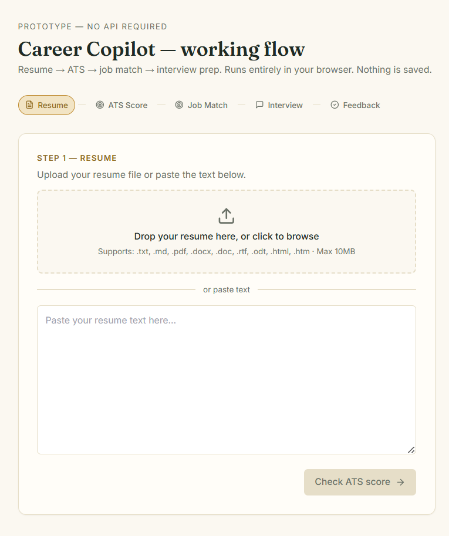
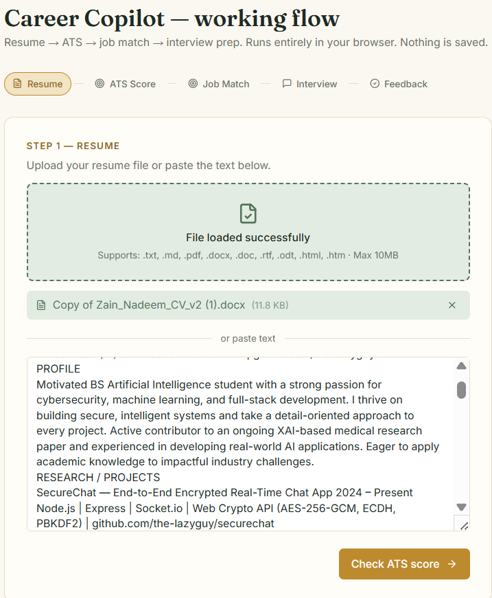

# Career Copilot

A fully client-side resume analysis, ATS scoring, job matching, and interview prep tool. No API keys, no data sent to servers — everything runs in your browser.



## Features

- **ATS Score** — Heuristic analysis of resume formatting, structure, and content
- **Job Match** — Keyword overlap analysis between resume and job description
- **Interview Prep** — Context-aware questions based on your resume and JD
- **Answer Feedback** — Heuristic evaluation of your interview answers



## Quick Start

```bash
# 1. Install dependencies
npm install

# 2. Start the development server
npm start

# 3. Open http://localhost:3000 in your browser
